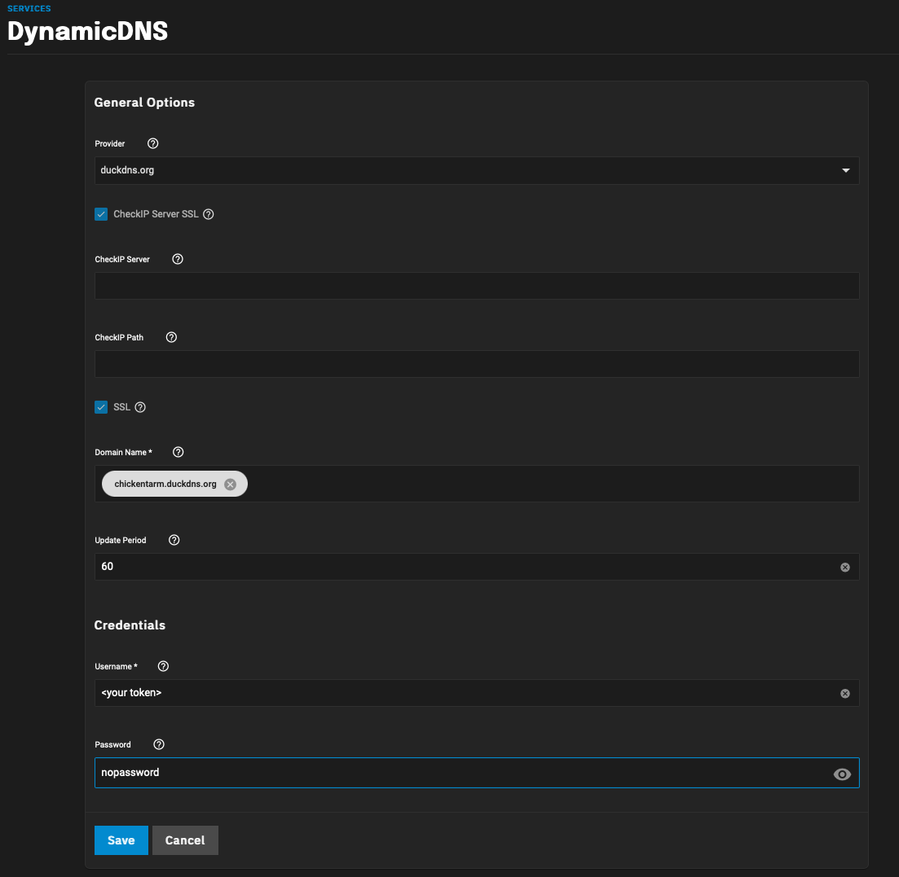
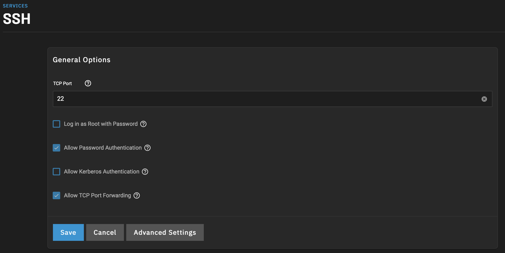

# my-homelab

This repo is meant to automatically setup a home server running many services.

It is expected that [TrueNAS Scale](https://www.truenas.com/download-truenas-scale/) is running as your OS

Make sure your home network isn't blocking UDP 123 which is what NTP uses.

And setup a duckdns domain [here](https://www.duckdns.org). Then configure through the TrueNAS UI the dynamic DNS by going to System Settings -> Services -> Dynamic DNS -> Configure

Clone this repo under the root user, and run

    python3 setup_my_homelab.py

To allow an IDE to ssh into TrueNAS by going to System Settings -> Services -> SSH -> Configure
